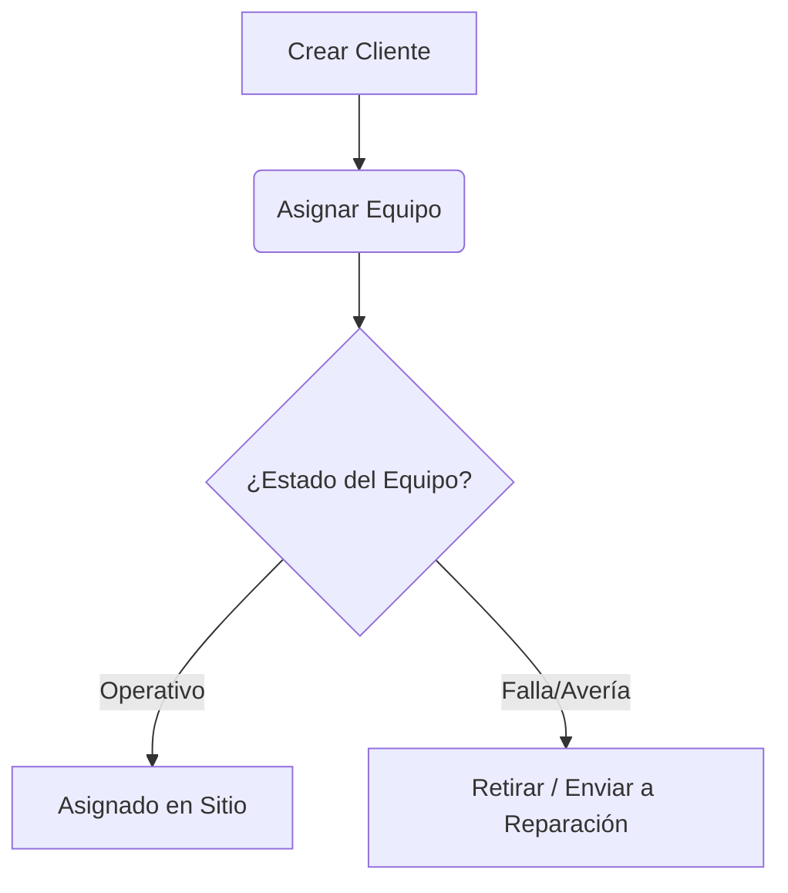
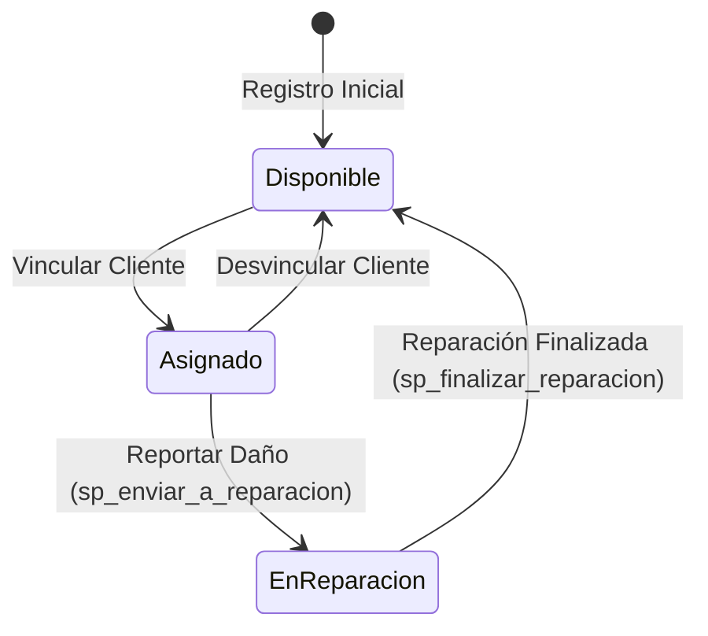

# ❄️ Manual de Usuario - CoolService
## Sistema de Gestión de Mantenimiento de Equipos Refrigerados

¡Bienvenido al Manual de Usuario de **CoolService**! Esta guía te orientará en el uso del sistema diseñado para gestionar de forma integral el inventario de neveras, la asignación de clientes, el historial técnico, las órdenes de servicio y los reportes de rendimiento.

---

## 🔐 1. Acceso al Sistema

Para ingresar a la plataforma, abre la aplicación en tu navegador web.

- **Usuario predeterminado**: `admin`
- **Contraseña predeterminada**: `admin123`

> [!NOTE]
> Por motivos de seguridad y desarrollo, las credenciales de administrador se validan mediante la configuración del sistema. Asegúrate de cambiarlas en producción.

---

## 📊 2. Panel Principal (Dashboard)

El **Dashboard** es la pantalla de inicio y proporciona una vista de 360 grados del estado actual de tu operación.

### Métricas Clave
- **Clientes Registrados**: Total de clientes activos en la plataforma.
- **Total Equipos**: El parque completo de neveras registradas.
- **Equipos en Reparación**: Cantidad de equipos inoperativos bajo servicio técnico.
- **Órdenes Pendientes**: Servicios técnicos que están a la espera de ser atendidos.
- **Órdenes Vencidas**: Servicios que han superado su fecha límite sin completarse.

### Gráficos y Visualizaciones
- **Distribución de Estados**: Gráfico circular con la proporción de equipos *operativos* vs *en reparación*.
- **Ocupación/Disponibilidad**: Estado de disponibilidad de los equipos (*disponibles*, *no disponibles* o *asignados*).
- **Órdenes Mensuales**: Histórico visual de servicios completados en los últimos meses.

---

## 🏢 3. Módulo de Clientes

Permite la administración de las empresas o personas naturales que alquilan o poseen los equipos de refrigeración.

### Acciones Disponibles:
1. **Crear Cliente**: Clic en **"Nuevo Cliente"**. Completa los campos:
   - *Nombre/Razón Social*
   - *Documento (NIT/Cédula)*: Único para cada registro.
   - *Dirección, Teléfono y Correo Electrónico*.
2. **Editar**: Modifica la información del cliente desde el botón de edición de la lista.
3. **Activar/Desactivar**: Cambia el interruptor de estado. Un cliente inactivo no podrá recibir nuevas asignaciones de neveras.
4. **Eliminar**: Elimina el registro si no tiene dependencias activas.

---

## 🧊 4. Módulo de Equipos (Neveras)

Este módulo gestiona la hoja de vida física y logística de cada nevera (placa, ubicación, limpieza y estado técnico).

### Atributos del Equipo:
- **Placa**: Identificador único de metal remachado en el chasis de la nevera.
- **Estado**: Puede ser `operativo` o `en_reparacion`.
- **Novedad**: Indica la disponibilidad del equipo (`disponible`, `no_disponible`, `asignado`).
- **Limpieza / Uso / Asignadas**: Campos informativos sobre condiciones físicas de entrega e higiene.

### Flujo de Estados del Equipo:

> [!TIP]
> **Cambio de Cliente o Reemplazo**: Puedes usar la opción **"Reasignar Cliente"** o **"Reemplazar Equipo"** directamente en la ficha del equipo sin tener que borrar el registro o perder su historial.

---

## 🛠️ 5. Módulo de Técnicos

Gestión de la fuerza de campo encargada de atender mantenimientos y reparaciones.

- **Campos**: Nombre Completo, Especialidad (ej: *Electricidad*, *Sistemas de Frío*, *General*) y Teléfono de contacto.
- **Asignación**: Los técnicos activos aparecerán disponibles al momento de crear o editar una Orden de Servicio.

---

## 📋 6. Órdenes de Servicio

Es el núcleo operativo del software. Modela cada visita técnica, reparación, instalación o retiro.

### Estados de la Orden:
| Estado | Descripción | color |
|---|---|---|
| **Pendiente** | Creada pero aún no se inicia el trabajo físico. | Amarillo 🟡 |
| **En Proceso** | El técnico se encuentra atendiendo la novedad en sitio o taller. | Azul 🔵 |
| **Completada** | Mantenimiento finalizado con éxito. El equipo vuelve a estar operativo. | Verde 🟢 |
| **Cancelada** | Orden anulada por cambio en la operación o error de digitación. | Rojo 🔴 |

### Crear una Orden:
1. Ve a **"Órdenes de Servicio"** ➔ Clic en **"Crear Orden"**.
2. Selecciona la **Placa del Equipo**.
3. Elige el **Técnico asignado**.
4. Define el **Tipo de Orden** (`mantenimiento`, `instalacion`, `retiro`, `reparacion`).
5. Indica si **"Es Reemplazo"**: Activa esta casilla si se retirará un equipo dañado y se colocará otro del inventario disponible.
6. Configura la **Fecha Límite** de atención.

---

## ⏳ 7. Alertas de Plazos y Vencimientos

El sistema cuenta con un proceso automático (Cron Job) que se ejecuta diariamente a las **8:00 AM** (`0 8 * * *`). 
Este proceso:
- Analiza las órdenes en estado **Pendiente** o **En Proceso**.
- Si la fecha actual supera la **Fecha Límite**, la orden se marca automáticamente en la interfaz como **Vencida 🚨**.
- Genera una alerta visual en el Dashboard principal para priorizar su atención.

---

## 📂 8. Historial General

Permite realizar auditoría de la operación. Registra automáticamente:
- **Historial de Equipos**: Cuándo se cambió de cliente, cuándo cambió de estado y qué observaciones se anotaron.
- **Historial de Órdenes**: Registro exacto de quién cambió el estado de la orden (de Pendiente a En Proceso, etc.) y la fecha/hora exacta del cambio.

---

## 📈 9. Módulo de Reportes

Genera reportes gerenciales con filtros de fecha interactivos:
- **Resumen Ejecutivo**: Descarga del estado de rendimiento.
- **Reporte Mensual**: Gráficos de barra que comparan la productividad mensual.
- **Productividad del Técnico**: Conteo de órdenes resueltas por cada especialista.
- **Eficiencia de Tiempos**: Diferencia promedio entre la fecha de inicio de la orden y la fecha de finalización.
